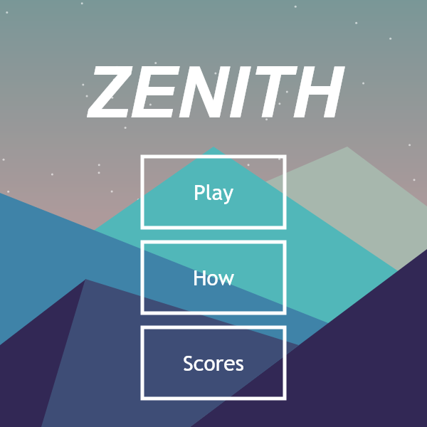
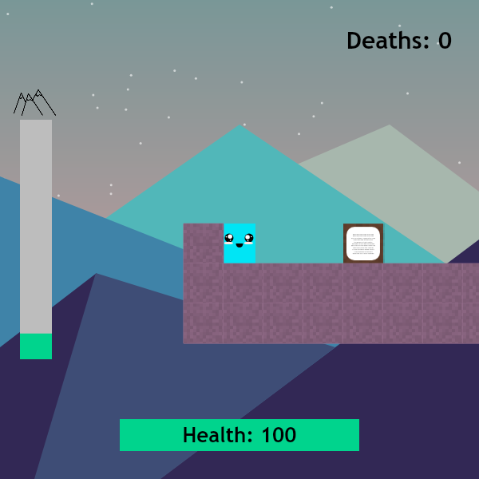
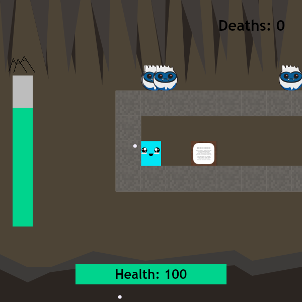

# Zenith

A 27-level precision platformer about climbing a mountain, built in Khan
Academy's ProcessingJS between 1 September and 5 October 2021 and released the
day it was finished. Every sprite and backdrop — the yetis, the signposts, the
dusk-lit peaks, the cave — is drawn in code at load time and cached to an
offscreen buffer. There are no image files anywhere in this project.

**[Play it here](https://robertclouddev.github.io/Zenith/)**

|  |  |
| :---: | :---: |
|  |  |

## The game

You are a small cyan cube with a nervous face, and you are going up.

Each level is a single screen-ish arena built from a character grid, and each
one ends at a pulsing blue **portal**. Touch it and you advance; there is no
going back. The green bar down the left edge, capped with a little mountain
peak, is how far up the climb you have got.

You have 100 health, and nothing in the game restores it — but every level
hands you a fresh 100, so the health bar is a per-level budget rather than a
resource to protect across the climb. Run it down, or fall off the bottom of
the world, and you restart the level with **one more death on the counter**.
Deaths are the only score the game keeps, and the number you finish with is the
number it congratulates you with.

The climb introduces one idea at a time, and the signposts scattered through
the levels are the tutorial:

- **Spikes** cost 3 health, bounce you upward, and take your jump away on the
  way — which is as often the problem as the damage is.
- **Teleporters** are one-way. The spinning purple one sends you to its partner.
- **Ice** looks harmless. Standing on it multiplies your speed by 1.03 every
  frame, so you accelerate the whole time you are on it and cannot stop where
  you meant to.
- **Trampolines** throw you about two and a half times as high as a jump. The
  game's own signpost puts it best: *"Trampolines are like spikes, except less
  deadly."*
- **Yetis** come in two kinds. The ones sliding back and forth on a fixed path
  cannot see you. The *smart* ones chase you across the level and jump when you
  get above them. Both hurt on contact, every frame you are touching them.

Snow starts falling once it gets cold — about a third of the way up — and never
stops. Five levels near the top move inside a yeti cave, grey stone and
stalactites and a frozen lake, before you break back out for the last stretch to
the summit.

## Controls

| | |
|---|---|
| Move | `A` `D`, or `←` `→` |
| Jump | `W`, or `↑` |
| Restart the level | `R` |
| Menus | Mouse |

One jump, no double jump. You do keep it after walking off an edge — the game
mentions this once, early, on a signpost reading *"Did you know? You can jump
after walking off a block"*, and then quietly expects you to use it for the
rest of the climb.

`R` counts as a death. It is still usually faster than falling.

## Tips

Let go of the movement key before you land on ice, not after. Your speed
compounds while you are in contact with it, and the only way to shed it is to
be off the ice.

The smart yetis only jump when you are above them, so staying level with one
makes it predictable. The signpost reading *"Even the 'smart' yetis are kinda
stupid"* is a hint, not a joke.

Spikes launch you upward. On a few levels that is the intended route.

## Leaderboard

The **Scores** screen is a snapshot of the Khan Academy leaderboard as it stood
when the program was released, sorted by fewest deaths. It is a hardcoded list
in `game.js`, not a live one — nothing you do in the browser writes to it. Edit
the `leader` array at the top of the file if you want your own run in there.

## Credits

Made by **littlewhinging** and **Corin Fist**. littlewhinging started the
program on 1 September 2021 and wrote the platformer physics, levels and menus;
Corin Fist came on board the next day and did the character and world graphics.
Finished and released on 5 October 2021.

- [littlewhinging on Khan Academy](https://www.khanacademy.org/computer-programming/littlewhingings-sub-page/6637078393733120)
- [Corin Fist on Khan Academy](https://www.khanacademy.org/computer-programming/homepage/5781861949784064)

Menu background inspired by [this flat landscape
vector](https://www.vectorstock.com/royalty-free-vector/flat-simple-landscape-background-vector-10035182).
